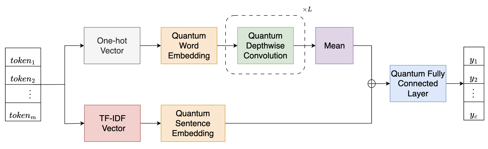

# Multi-Scale Feature Fusion Quantum Depthwise Convolutional Neural Networks

## Overview

The MSFF-QDConv model is a QNN model based on the quantum depthwise convolution, quantum embedding, and multi-scale feature fusion mechanism. The MSFF-QDConv model establishes a new state-of-the-art test accuracy of 96.77% on the RP dataset. Due to the use of the quantum depthwise convolution, the MSFF-QDConv model has fewer parameters and lower computational complexity compared to conventional QCNN models.

<p align="center">
  
</p>
<p align="center">
  The architecture of the MSFF-QDConv model
</p>

## Requirements

- numpy==1.23.5
- pandas==2.0.3
- pyqpanda==3.8.3.2
- pyvqnet==2.11.0

Use the following code to install pyvqnet:

```
$ pip install pyvqnet --index-url https://pypi.originqc.com.cn
```

When installing pyvqnet, pyqpanda will be automatically installed as a dependency.

## Usage

Take the `RP/` directory for example.

- quantum models

  Use the following code for model evaluation:

  ```
  $ python RP_q_eval.py model-name
  ```

  Use the following code for model training:

  ```
  $ python RP_q.py model-name
  ```

  The command-line argument `model-name` can be either 'msff-qdconv' or 'msff-dconv'. The pre-trained models are located in the `model/RP` directory. See `RP.ipynb` for a demo of model training.

- classical models

  Use the following code for model evaluation:

  ```
  $ python RP_c_eval.py model-name
  ```

  Use the following code for model training:

  ```
  $ python RP_c.py model-name
  ```

  The command-line argument `model-name` can be either 'msff-dconv' or 'msff-conv'. The pre-trained models are located in the `RP/model/RP` directory.

The `MC/` directory has the same code structure.
